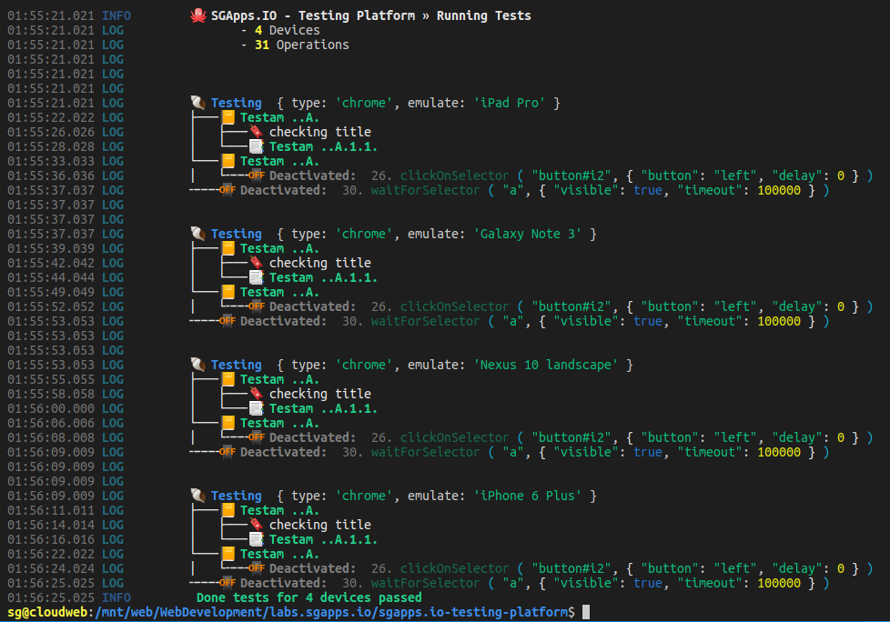
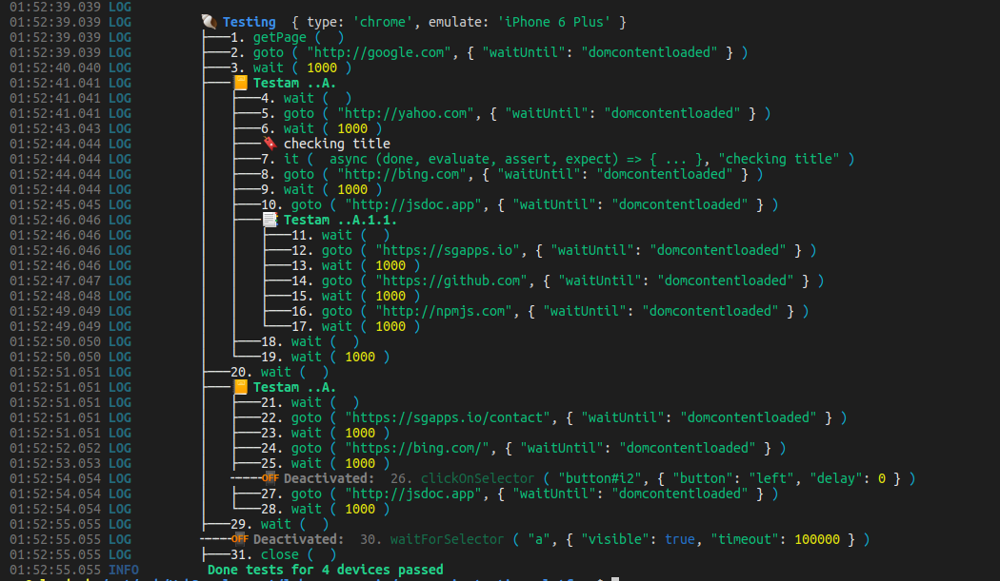

# 🐙 SGApps.IO Testing Platform

<div class="page-header">
<em>Easy way to build testing scenarios</em>

🐙 SGApps.IO Testing Platform

<em>easy and intuitive functional testing based on <u>puppeteer</u></em>

</div>

<style>
    .page-header::first-letter {
        font-size: 45px;
    }
    .page-header {
        background: #ff204030;
        padding: 80px 60px;
        font-size: 27px;
    }
    .page-header em {
        font-size: 14px;
        float: right;
    }
</style>

## Emulation mode

Testing Platform based on `puppeteer` and `puppeteer-firefox` it uses these modules for emulation part.

Offers possibility to define a scenario, if you want you may fork testing scenario and build another one

In single row you may run same testing scenario under different Browsers and environments.

-   📳 Available **emulation for 71 devices**
-   You may run using **Chrome** 🌐 or **Firefox Browsers** 🦊
-   🍽 You can fork a testing Scenario and make other with chages
-   Easily to use **Expect** and **Assert** functionalities.
-   You can easily create functionality groups and subgroups in your test
-   Support for working with file Inputs
-   🆒 **IntelliSense Support**

## Why to use, describing concept

Reason for creating this library was to build a very friendly environment for functional testing, that can be easily installed without additional configurations.

Concept is based building easy to read intuitive scenarios that can be understood by anyone.

When You have 2 Testing Scenarios that are the same under specific step, you can fork them on any step, and the fork represents a clone a scenario until that step.

## Example

```javascript
let Scenario = new TestScenario();

Scenario
	.isHeadLess(true)
	.isVerbose(false) // enable to view detailed step logs
	.getPage()
	.goto('http://google.com', { waitUntil: "domcontentloaded" })
	.wait(1000)
	.describe('Functionality Group')
		.goto('http://yahoo.com', { waitUntil: "domcontentloaded" })
		.wait(1000)
		.it(async (done, evaluate, assert, expect) => {
			let title = await evaluate('document.title');

			expect(title).to().be().a("string");

			assert.isNotNull(title);
			done();
		}, "Example of checking block » checking title")
		.goto('http://bing.com', { waitUntil: "domcontentloaded" })
		.wait(1000)
		.goto('http://jsdoc.app', { waitUntil: "domcontentloaded" })

		.describe('Functionality SubGroup')
			.goto('https://sgapps.io', { waitUntil: "domcontentloaded" })
			.wait(1000)
			.goto('https://github.com', { waitUntil: "domcontentloaded" })
			.wait(1000)
			.goto('https://npmjs.com', { waitUntil: "domcontentloaded" })
			.wait(1000)
		.describeClose()
		.wait(1000)
	.describeClose()
	.close();
```

## ScreenShots

### Testing multiple devices with same test scenario



### Testing in Verbose mode - view all steps



## API

<!-- Generated by documentation.js. Update this documentation by updating the source code. -->

#### Table of Contents

-   [TestingScenario](#testingscenario)
    -   [isHeadLess](#isheadless)
    -   [isVerbose](#isverbose)
    -   [ScenarioName](#scenarioname)
    -   [\_getPage](#_getpage)
    -   [getPage](#getpage)
    -   [setViewport](#setviewport)
    -   [setViewport](#setviewport-1)
    -   [goto](#goto)
    -   [goto](#goto-1)
    -   [wait](#wait)
    -   [pageEventWait](#pageeventwait)
    -   [waitForFileChooser](#waitforfilechooser)
    -   [waitForFunction](#waitforfunction)
    -   [waitForFunction](#waitforfunction-1)
    -   [waitForNavigation](#waitfornavigation)
    -   [waitForNavigation](#waitfornavigation-1)
    -   [waitForSelector](#waitforselector)
    -   [waitForSelector](#waitforselector-1)
    -   [waitForXPath](#waitforxpath)
    -   [waitForXPath](#waitforxpath-1)
    -   [userAgent](#useragent)
    -   [clearPermissionOverrides](#clearpermissionoverrides)
    -   [overridePermissions](#overridepermissions)
    -   [pageClose](#pageclose)
    -   [pageClose](#pageclose-1)
    -   [pageSetLabel](#pagesetlabel)
    -   [pageReload](#pagereload)
    -   [pageReload](#pagereload-1)
    -   [pageContent](#pagecontent)
    -   [clickOnSelector](#clickonselector)
    -   [clickOnSelector](#clickonselector-1)
    -   [typeOnSelector](#typeonselector)
    -   [typeOnSelector](#typeonselector-1)
    -   [tapOnSelector](#taponselector)
    -   [focusOnSelector](#focusonselector)
    -   [hoverOnSelector](#hoveronselector)
    -   [evaluate](#evaluate)
    -   [evaluateOnSelectorAll](#evaluateonselectorall)
    -   [evaluateOnSelectorOnlyOne](#evaluateonselectoronlyone)
    -   [pageEmulate](#pageemulate)
    -   [pageEmulate](#pageemulate-1)
    -   [pageEmulate](#pageemulate-2)
    -   [message](#message)
    -   [operationLabels](#operationlabels)
    -   [operationLabelsRemove](#operationlabelsremove)
    -   [deactivate](#deactivate)
    -   [describe](#describe)
    -   [describeClose](#describeclose)
    -   [group](#group)
    -   [groupClose](#groupclose)
    -   [injectScenario](#injectscenario)
    -   [it](#it)
    -   [fork](#fork)
    -   [fork](#fork-1)
    -   [close](#close)
    -   [run](#run)
-   [TestingScenarioInstancePermissions](#testingscenarioinstancepermissions)
-   [TestingScenarioPageReloadOptionsWaitUntil](#testingscenariopagereloadoptionswaituntil)
-   [TestingScenarioPageEmulateDeviceName](#testingscenariopageemulatedevicename)
-   [TestingScenarioItHandlerCallback](#testingscenarioithandlercallback)
-   [assert](#assert)
-   [expect](#expect)
    -   [to](#to)
-   [expectTo](#expectto)
    -   [be](#be)
-   [expectToBe](#expecttobe)
-   [ExpectedType](#expectedtype)
-   [Expect.to.be.a](#expecttobea)
-   [Expect.to.be.notA](#expecttobenota)
-   [Expect.to.be.instanceOf](#expecttobeinstanceof)
-   [expectValueDescribe](#expectvaluedescribe)

### [TestingScenario](https://git@labs.sgapps.io/:open-source/sgapps.io-testing-platform/blob/41a2fe07bb4babcb6de9403868a2ac4c4be6c593/index.js#L12-L136)

Type: `function ()`

* * *

#### [isHeadLess](https://git@labs.sgapps.io/:open-source/sgapps.io-testing-platform/blob/41a2fe07bb4babcb6de9403868a2ac4c4be6c593/index.js#L21-L27)

Indicates if Browser should run in headless mode

Type: `function (isHeadLess): TestingScenario`

-   `isHeadLess` **[Boolean](https://developer.mozilla.org/docs/Web/JavaScript/Reference/Global_Objects/Boolean)?** if parameter is not passed function will return current `isHeadLess` value

* * *

#### [isVerbose](https://git@labs.sgapps.io/:open-source/sgapps.io-testing-platform/blob/41a2fe07bb4babcb6de9403868a2ac4c4be6c593/index.js#L34-L40)

Indicates if tests should run in verbose mode

Type: `function (isVerbose, isHeadLess): TestingScenario`

-   `isVerbose`  
-   `isHeadLess` **[Boolean](https://developer.mozilla.org/docs/Web/JavaScript/Reference/Global_Objects/Boolean)?** if parameter is not passed function will return current `isVerbose` value

* * *

#### [ScenarioName](https://git@labs.sgapps.io/:open-source/sgapps.io-testing-platform/blob/41a2fe07bb4babcb6de9403868a2ac4c4be6c593/index.js#L47-L53)

Specify or get Current Scenario Name

Type: `function (name): TestingScenario`

-   `name` **[String](https://developer.mozilla.org/docs/Web/JavaScript/Reference/Global_Objects/String)?** if parameter is not passed function will return current `name`

* * *

#### [\_getPage](https://git@labs.sgapps.io/:open-source/sgapps.io-testing-platform/blob/41a2fe07bb4babcb6de9403868a2ac4c4be6c593/index.js#L85-L133)

Select from instance a page with specific index

Type: `function (instance, index, PuppeteerInstance)`

-   `instance`  
-   `index` **([Number](https://developer.mozilla.org/docs/Web/JavaScript/Reference/Global_Objects/Number) \| `"next"` \| `"prev"` \| [String](https://developer.mozilla.org/docs/Web/JavaScript/Reference/Global_Objects/String))** Page's index or 'next', 'prev', 'last' or 'first' or pages label (optional, default `(instance.currentPage._getLabelName||0)`)
-   `PuppeteerInstance`  

* * *

#### [getPage](https://git@labs.sgapps.io/:open-source/sgapps.io-testing-platform/blob/41a2fe07bb4babcb6de9403868a2ac4c4be6c593/index.js#L143-L154)

Select from instance a page with specific index

Type: `function (index): TestingScenario`

-   `index` **([Number](https://developer.mozilla.org/docs/Web/JavaScript/Reference/Global_Objects/Number) \| `"next"` \| `"prev"` \| [String](https://developer.mozilla.org/docs/Web/JavaScript/Reference/Global_Objects/String))** Page's index or 'next', 'prev', 'last' or 'first' or pages label (optional, default `(instance.currentPage._getLabelName||0)`)

* * *

#### [setViewport](https://git@labs.sgapps.io/:open-source/sgapps.io-testing-platform/blob/41a2fe07bb4babcb6de9403868a2ac4c4be6c593/index.js#L170-L192)

Applying specific viewport for device

Type: `function (options): TestingScenario`

-   `options` **TestingScenarioSetViewportOptions** 

* * *

#### [setViewport](https://git@labs.sgapps.io/:open-source/sgapps.io-testing-platform/blob/41a2fe07bb4babcb6de9403868a2ac4c4be6c593/index.js#L170-L192)

Type: `function (options)`

-   `options`  


-   `width` **[Number](https://developer.mozilla.org/docs/Web/JavaScript/Reference/Global_Objects/Number)?** device width in pixels
-   `height` **[Number](https://developer.mozilla.org/docs/Web/JavaScript/Reference/Global_Objects/Number)?** device height in pixels
-   `deviceScaleFactor` **[Number](https://developer.mozilla.org/docs/Web/JavaScript/Reference/Global_Objects/Number)?** Device Scale Factor
-   `hasTouch` **[Boolean](https://developer.mozilla.org/docs/Web/JavaScript/Reference/Global_Objects/Boolean)?** Emulate touch instead of click
-   `isLandscape` **[Boolean](https://developer.mozilla.org/docs/Web/JavaScript/Reference/Global_Objects/Boolean)?** is device in landscape mode
-   `isMobile` **isMobile?** is mobile device

* * *

#### [goto](https://git@labs.sgapps.io/:open-source/sgapps.io-testing-platform/blob/41a2fe07bb4babcb6de9403868a2ac4c4be6c593/index.js#L206-L227)

Opens an URL

Type: `function (url, options): TestingScenario`

-   `url` **[String](https://developer.mozilla.org/docs/Web/JavaScript/Reference/Global_Objects/String)** URL to navigate page to. The url should include scheme, e.g. https&#x3A;//.
-   `options` **TestingScenarioGotoOptions?** Navigation parameters

* * *

#### [goto](https://git@labs.sgapps.io/:open-source/sgapps.io-testing-platform/blob/41a2fe07bb4babcb6de9403868a2ac4c4be6c593/index.js#L206-L227)

Type: `function (url, options)`

-   `url`  
-   `options`  


-   `waitUntil` **(`"load"` \| `"domcontentloaded"` \| `"networkidle0"` \| `"networkidle2"`)?** When to consider navigation succeeded, defaults to `'load'`. Given an array of event strings, navigation is considered to be successful after all events have been fired. Events can be either:
-   `timeout` **[Number](https://developer.mozilla.org/docs/Web/JavaScript/Reference/Global_Objects/Number)?** Maximum navigation time in milliseconds, defaults to 30 seconds, pass 0 to disable timeout. The default value can be changed by using the page.setDefaultNavigationTimeout(timeout) or page.setDefaultTimeout(timeout) methods.
-   `referer` **[String](https://developer.mozilla.org/docs/Web/JavaScript/Reference/Global_Objects/String)?** Referer header value. If provided it will take preference over the referer header value set by page.setExtraHTTPHeaders().

* * *

#### [wait](https://git@labs.sgapps.io/:open-source/sgapps.io-testing-platform/blob/41a2fe07bb4babcb6de9403868a2ac4c4be6c593/index.js#L234-L248)

wait a priod of specified miliseconds

Type: `function (timeMs): TestingScenario`

-   `timeMs` **[Number](https://developer.mozilla.org/docs/Web/JavaScript/Reference/Global_Objects/Number)** number of miliseconds

* * *

#### [pageEventWait](https://git@labs.sgapps.io/:open-source/sgapps.io-testing-platform/blob/41a2fe07bb4babcb6de9403868a2ac4c4be6c593/index.js#L256-L277)

Wait until a page will reach an event

Type: `function (eventName, handler): TestingScenario`

-   `eventName` **(`"close"` \| `"console"` \| `"dialog"` \| `"domcontentloaded"` \| `"error"` \| `"frameattached"` \| `"framedetached"` \| `"framenavigated"` \| `"load"` \| `"metrics"` \| `"pageerror"` \| `"popup"` \| `"request"` \| `"requestfailed"` \| `"requestfinished"` \| `"response"` \| `"workercreated"` \| `"workerdestroyed"`)** 
-   `handler` **`function (any): Promise`?** a function that can execute specific operations with data obtained on event

* * *

#### [waitForFileChooser](https://git@labs.sgapps.io/:open-source/sgapps.io-testing-platform/blob/41a2fe07bb4babcb6de9403868a2ac4c4be6c593/index.js#L285-L309)

add a files to input[type="file"] in instance's page

Type: `function (files, selector): TestingScenario`

-   `files` **[Array](https://developer.mozilla.org/docs/Web/JavaScript/Reference/Global_Objects/Array)&lt;[String](https://developer.mozilla.org/docs/Web/JavaScript/Reference/Global_Objects/String)>** list of file paths to be added to input
-   `selector` **[String](https://developer.mozilla.org/docs/Web/JavaScript/Reference/Global_Objects/String)** CSS Selector used to identify input[type="file"]

* * *

#### [waitForFunction](https://git@labs.sgapps.io/:open-source/sgapps.io-testing-platform/blob/41a2fe07bb4babcb6de9403868a2ac4c4be6c593/index.js#L325-L342)

Type: `function (pageFunction, options)`

-   `pageFunction`  
-   `options`  


-   `polling` **(`"raf"` \| `"polling"` \| `"mutation"`)?** An interval at which the pageFunction is executed, defaults to raf. If polling is a number, then it is treated as an interval in milliseconds at which the function would be executed. If polling is a string, then it can be one of the following values:-   `raf` - to constantly execute pageFunction in requestAnimationFrame callback. This is the tightest polling mode which is suitable to observe styling changes.
    -   `mutation` - to execute pageFunction on every DOM mutation.
-   `timeout` **[Number](https://developer.mozilla.org/docs/Web/JavaScript/Reference/Global_Objects/Number)?** maximum time to wait for in milliseconds, Defaults to 30000 (30 seconds). Pass 0 to disable timeout.

* * *

#### [waitForFunction](https://git@labs.sgapps.io/:open-source/sgapps.io-testing-platform/blob/41a2fe07bb4babcb6de9403868a2ac4c4be6c593/index.js#L325-L342)

wait until browser will pageFunction will return true value

Type: `function (pageFunction, options): TestingScenario`

-   `pageFunction` **([String](https://developer.mozilla.org/docs/Web/JavaScript/Reference/Global_Objects/String) \| [Function](https://developer.mozilla.org/docs/Web/JavaScript/Reference/Statements/function))** Function to be evaluated in browser context
-   `options` **TestingScenarioWaitForFunctionOptions** Optional waiting parameters

* * *

#### [waitForNavigation](https://git@labs.sgapps.io/:open-source/sgapps.io-testing-platform/blob/41a2fe07bb4babcb6de9403868a2ac4c4be6c593/index.js#L360-L376)

Type: `function (options)`

-   `options`  


-   `waitUntil` **(`"load"` \| `"domcontentloaded"` \| `"networkidle0"` \| `"networkidle2"`)?** When to consider navigation succeeded, defaults to load. Given an array of event strings, navigation is considered to be successful after all events have been fired. Events can be either:-   `load` - consider navigation to be finished when the load event is fired.
    -   `domcontentloaded` - consider navigation to be finished when the DOMContentLoaded event is fired.
    -   `networkidle0` - consider navigation to be finished when there are no more than 0 network connections for at least 500 ms.
    -   `networkidle2` - consider navigation to be finished when there are no more than 2 network connections for at least 500 ms.
-   `timeout` **[Number](https://developer.mozilla.org/docs/Web/JavaScript/Reference/Global_Objects/Number)?** maximum time to wait for in milliseconds, Defaults to 30000 (30 seconds). Pass 0 to disable timeout.

* * *

#### [waitForNavigation](https://git@labs.sgapps.io/:open-source/sgapps.io-testing-platform/blob/41a2fe07bb4babcb6de9403868a2ac4c4be6c593/index.js#L360-L376)

wait specific navigation state

Type: `function (options): TestingScenario`

-   `options` **TestingScenarioWaitForNavigationOptions** Optional waiting parameters

* * *

#### [waitForSelector](https://git@labs.sgapps.io/:open-source/sgapps.io-testing-platform/blob/41a2fe07bb4babcb6de9403868a2ac4c4be6c593/index.js#L391-L407)

Type: `function (selector, options)`

-   `selector`  
-   `options`  


-   `visible` **[Boolean](https://developer.mozilla.org/docs/Web/JavaScript/Reference/Global_Objects/Boolean)?** wait for element to be present in DOM and to be visible, i.e. to not have `display: none` or `visibility: hidden` CSS properties. Defaults to `false`.
-   `hidden` **[Boolean](https://developer.mozilla.org/docs/Web/JavaScript/Reference/Global_Objects/Boolean)?** wait for element to not be found in the DOM or to be hidden, i.e. have `display: none` or `visibility: hidden` CSS properties. Defaults to `false`.
-   `timeout` **[Number](https://developer.mozilla.org/docs/Web/JavaScript/Reference/Global_Objects/Number)?** maximum time to wait for in milliseconds, Defaults to 30000 (30 seconds). Pass 0 to disable timeout.

* * *

#### [waitForSelector](https://git@labs.sgapps.io/:open-source/sgapps.io-testing-platform/blob/41a2fe07bb4babcb6de9403868a2ac4c4be6c593/index.js#L391-L407)

Wait for the selector to appear in page. If at the moment of calling the method the selector already exists, the method will return immediately. If the selector doesn't appear after the timeout milliseconds of waiting, the function will throw.

Type: `function (selector, options): TestingScenario`

-   `selector` **[String](https://developer.mozilla.org/docs/Web/JavaScript/Reference/Global_Objects/String)** A selector of an element to wait for
-   `options` **TestingScenarioWaitForSelectorOptions** Optional waiting parameters

* * *

#### [waitForXPath](https://git@labs.sgapps.io/:open-source/sgapps.io-testing-platform/blob/41a2fe07bb4babcb6de9403868a2ac4c4be6c593/index.js#L421-L437)

Type: `function (xpath, options)`

-   `xpath`  
-   `options`  


-   `visible` **[Boolean](https://developer.mozilla.org/docs/Web/JavaScript/Reference/Global_Objects/Boolean)?** wait for element to be present in DOM and to be visible, i.e. to not have `display: none` or `visibility: hidden` CSS properties. Defaults to `false`.
-   `hidden` **[Boolean](https://developer.mozilla.org/docs/Web/JavaScript/Reference/Global_Objects/Boolean)?** wait for element to not be found in the DOM or to be hidden, i.e. have `display: none` or `visibility: hidden` CSS properties. Defaults to `false`.
-   `timeout` **[Number](https://developer.mozilla.org/docs/Web/JavaScript/Reference/Global_Objects/Number)?** maximum time to wait for in milliseconds, Defaults to 30000 (30 seconds). Pass 0 to disable timeout.

* * *

#### [waitForXPath](https://git@labs.sgapps.io/:open-source/sgapps.io-testing-platform/blob/41a2fe07bb4babcb6de9403868a2ac4c4be6c593/index.js#L421-L437)

Wait for the xpath to appear in page. If at the moment of calling the method the xpath already exists, the method will return immediately. If the xpath doesn't appear after the timeout milliseconds of waiting, the function will throw.

Type: `function (xpath, options): TestingScenario`

-   `xpath` **[String](https://developer.mozilla.org/docs/Web/JavaScript/Reference/Global_Objects/String)** A xpath of an element to wait for
-   `options` **TestingScenarioWaitForXPathOptions** Optional waiting parameters

* * *

#### [userAgent](https://git@labs.sgapps.io/:open-source/sgapps.io-testing-platform/blob/41a2fe07bb4babcb6de9403868a2ac4c4be6c593/index.js#L444-L460)

Handle User agent of instance

Type: `function (handler): TestingScenario`

-   `handler` **`function (userAgent): Promise`** if parameter is present will handle UserAgent value

* * *

#### [clearPermissionOverrides](https://git@labs.sgapps.io/:open-source/sgapps.io-testing-platform/blob/41a2fe07bb4babcb6de9403868a2ac4c4be6c593/index.js#L467-L478)

Clears all permission overrides for the browser context.

Type: `function (): TestingScenario`

* * *

#### [overridePermissions](https://git@labs.sgapps.io/:open-source/sgapps.io-testing-platform/blob/41a2fe07bb4babcb6de9403868a2ac4c4be6c593/index.js#L489-L500)

Override permissions for the browser context.

Type: `function (origin, permissions): TestingScenario`

-   `origin` **[String](https://developer.mozilla.org/docs/Web/JavaScript/Reference/Global_Objects/String)** The origin to grant permissions to, e.g. "<https://example.com">.
-   `permissions` **[Array](https://developer.mozilla.org/docs/Web/JavaScript/Reference/Global_Objects/Array)&lt;[TestingScenarioInstancePermissions](#testingscenarioinstancepermissions)>** An array of permissions to grant. All permissions that are not listed here will be automatically denied.

* * *

#### [pageClose](https://git@labs.sgapps.io/:open-source/sgapps.io-testing-platform/blob/41a2fe07bb4babcb6de9403868a2ac4c4be6c593/index.js#L512-L528)

Type: `function (options, index)`

-   `options`  
-   `index`  


-   `runBeforeUnload` **[Boolean](https://developer.mozilla.org/docs/Web/JavaScript/Reference/Global_Objects/Boolean)** Defaults to `false`. Whether to run the before unload page handlers.

* * *

#### [pageClose](https://git@labs.sgapps.io/:open-source/sgapps.io-testing-platform/blob/41a2fe07bb4babcb6de9403868a2ac4c4be6c593/index.js#L512-L528)

Close a page from instance

Type: `function (options, index): TestingScenario`

-   `options` **TestingScenarioPageCloseOptions?** set of options
-   `index` **[String](https://developer.mozilla.org/docs/Web/JavaScript/Reference/Global_Objects/String)?** page's index

* * *

#### [pageSetLabel](https://git@labs.sgapps.io/:open-source/sgapps.io-testing-platform/blob/41a2fe07bb4babcb6de9403868a2ac4c4be6c593/index.js#L535-L552)

Set page label, for easier selecting using .getPage(label)

Type: `function (label): TestingScenario`

-   `label` **[String](https://developer.mozilla.org/docs/Web/JavaScript/Reference/Global_Objects/String)** label that will be set on current page

* * *

#### [pageReload](https://git@labs.sgapps.io/:open-source/sgapps.io-testing-platform/blob/41a2fe07bb4babcb6de9403868a2ac4c4be6c593/index.js#L580-L596)

Type: `function (index, options)`

-   `index`  
-   `options`  


-   `timeout` **[Number](https://developer.mozilla.org/docs/Web/JavaScript/Reference/Global_Objects/Number)** Maximum navigation time in milliseconds, defaults to `30` seconds, pass `0` to disable timeout.
-   `waitUntil` **([TestingScenarioPageReloadOptionsWaitUntil](#testingscenariopagereloadoptionswaituntil) \| [Array](https://developer.mozilla.org/docs/Web/JavaScript/Reference/Global_Objects/Array)&lt;[TestingScenarioPageReloadOptionsWaitUntil](#testingscenariopagereloadoptionswaituntil)>)** When to consider navigation succeeded, defaults to load. Given an array of event strings, navigation is considered to be successful after all events have been fired. Events can be either:-   `load` - consider navigation to be finished when the load event is fired.
    -   `domcontentloaded` - consider navigation to be finished when the DOMContentLoaded event is fired.
    -   `networkidle0` - consider navigation to be finished when there are no more than 0 network connections for at least 500 ms.
    -   `networkidle2` - consider navigation to be finished when there are no more than 2 network connections for at least 500 ms.

* * *

#### [pageReload](https://git@labs.sgapps.io/:open-source/sgapps.io-testing-platform/blob/41a2fe07bb4babcb6de9403868a2ac4c4be6c593/index.js#L580-L596)

Close a page from instance

Type: `function (index, options): TestingScenario`

-   `index` **[String](https://developer.mozilla.org/docs/Web/JavaScript/Reference/Global_Objects/String)** page's index
-   `options` **TestingScenarioPageReloadOptions** set of options

* * *

#### [pageContent](https://git@labs.sgapps.io/:open-source/sgapps.io-testing-platform/blob/41a2fe07bb4babcb6de9403868a2ac4c4be6c593/index.js#L603-L623)

Handle User agent of instance

Type: `function (handler)`

-   `handler` **`function (userAgent)`** if parameter is present will handle UserAgent value

* * *

#### [clickOnSelector](https://git@labs.sgapps.io/:open-source/sgapps.io-testing-platform/blob/41a2fe07bb4babcb6de9403868a2ac4c4be6c593/index.js#L637-L653)

Type: `function (selector, options)`

-   `selector`  
-   `options`  


-   `button` **(`"left"` \| `"right"` \| `"middle"`)** Defaults to `left`.
-   `clickCount` **[Number](https://developer.mozilla.org/docs/Web/JavaScript/Reference/Global_Objects/Number)** defaults to `1`.
-   `delay` **[Number](https://developer.mozilla.org/docs/Web/JavaScript/Reference/Global_Objects/Number)** Time to wait between mousedown and mouseup in milliseconds. Defaults to `0`.

* * *

#### [clickOnSelector](https://git@labs.sgapps.io/:open-source/sgapps.io-testing-platform/blob/41a2fe07bb4babcb6de9403868a2ac4c4be6c593/index.js#L637-L653)

This method fetches an element with selector, scrolls it into view if needed, and then uses page.mouse to click in the center of the element. If there's no element matching selector, the method throws an error.

Type: `function (selector, options): TestingScenario`

-   `selector` **[String](https://developer.mozilla.org/docs/Web/JavaScript/Reference/Global_Objects/String)** A selector to search for element to click. If there are multiple elements satisfying the selector, the first will be clicked.
-   `options` **TestingScenarioClickOnSelectorOptions** Optional parameters

* * *

#### [typeOnSelector](https://git@labs.sgapps.io/:open-source/sgapps.io-testing-platform/blob/41a2fe07bb4babcb6de9403868a2ac4c4be6c593/index.js#L666-L682)

Type: `function (selector, text, options)`

-   `selector`  
-   `text`  
-   `options`  


-   `delay` **[Number](https://developer.mozilla.org/docs/Web/JavaScript/Reference/Global_Objects/Number)** Time to wait between key presses in milliseconds. Defaults to 0.

* * *

#### [typeOnSelector](https://git@labs.sgapps.io/:open-source/sgapps.io-testing-platform/blob/41a2fe07bb4babcb6de9403868a2ac4c4be6c593/index.js#L666-L682)

Sends a `keydown`, `keypress/input`, and `keyup` event for each character in the text.

Type: `function (selector, text, options): TestingScenario`

-   `selector` **[String](https://developer.mozilla.org/docs/Web/JavaScript/Reference/Global_Objects/String)** A selector of an element to type into. If there are multiple elements satisfying the selector, the first will be used.
-   `text` **[String](https://developer.mozilla.org/docs/Web/JavaScript/Reference/Global_Objects/String)** A text to type into a focused element.
-   `options` **TestingScenarioTypeOnSelectorOptions** Optional parameters

* * *

#### [tapOnSelector](https://git@labs.sgapps.io/:open-source/sgapps.io-testing-platform/blob/41a2fe07bb4babcb6de9403868a2ac4c4be6c593/index.js#L691-L706)

This method fetches an element with `selector`, scrolls it into view if needed, and then uses `page.touchscreen` to tap in the center of the element. If there's no element matching `selector`, the method throws an error.

Type: `function (selector): TestingScenario`

-   `selector` **[String](https://developer.mozilla.org/docs/Web/JavaScript/Reference/Global_Objects/String)** A selector to search for element to tap. If there are multiple elements satisfying the selector, the first will be tapped.

* * *

#### [focusOnSelector](https://git@labs.sgapps.io/:open-source/sgapps.io-testing-platform/blob/41a2fe07bb4babcb6de9403868a2ac4c4be6c593/index.js#L713-L728)

This method fetches an element with `selector` and focuses it. If there's no element matching `selector`, the method throws an error.

Type: `function (selector): TestingScenario`

-   `selector` **[String](https://developer.mozilla.org/docs/Web/JavaScript/Reference/Global_Objects/String)** A selector of an element to focus. If there are multiple elements satisfying the selector, the first will be focused.

* * *

#### [hoverOnSelector](https://git@labs.sgapps.io/:open-source/sgapps.io-testing-platform/blob/41a2fe07bb4babcb6de9403868a2ac4c4be6c593/index.js#L735-L750)

This method fetches an element with `selector`, scrolls it into view if needed, and then uses page.mouse to hover over the center of the element. If there's no element matching `selector`, the method throws an error.

Type: `function (selector): TestingScenario`

-   `selector` **[String](https://developer.mozilla.org/docs/Web/JavaScript/Reference/Global_Objects/String)** A selector to search for element to hover. If there are multiple elements satisfying the selector, the first will be hovered.

* * *

#### [evaluate](https://git@labs.sgapps.io/:open-source/sgapps.io-testing-platform/blob/41a2fe07bb4babcb6de9403868a2ac4c4be6c593/index.js#L759-L784)

If the function passed to the page.evaluate returns a non-Serializable value, then page.evaluate resolves to undefined. DevTools Protocol also supports transferring some additional values that are not serializable by JSON: -0, NaN, Infinity, -Infinity, and bigint literals.

Type: `function (pageFunction, handler, variables, meta): TestingScenario`

-   `pageFunction` **(`function (Object): any` \| [String](https://developer.mozilla.org/docs/Web/JavaScript/Reference/Global_Objects/String))** Function to be evaluated in the page context
-   `handler` **`function (result): Promise`?** function that receives serializable data from `pageFunction`
-   `variables` **[Object](https://developer.mozilla.org/docs/Web/JavaScript/Reference/Global_Objects/Object)** context passed to `pageFunction` (optional, default `{}`)
-   `meta`  

* * *

#### [evaluateOnSelectorAll](https://git@labs.sgapps.io/:open-source/sgapps.io-testing-platform/blob/41a2fe07bb4babcb6de9403868a2ac4c4be6c593/index.js#L846-L880)

If the function passed to the page.evaluate returns a non-Serializable value, then page.evaluate resolves to undefined. DevTools Protocol also supports transferring some additional values that are not serializable by JSON: -0, NaN, Infinity, -Infinity, and bigint literals.

Type: `function (selector, pageFunction, handler, value): TestingScenario`

-   `selector` **[String](https://developer.mozilla.org/docs/Web/JavaScript/Reference/Global_Objects/String)** A selector for an selecting element
-   `pageFunction` **([Function](https://developer.mozilla.org/docs/Web/JavaScript/Reference/Statements/function) \| [String](https://developer.mozilla.org/docs/Web/JavaScript/Reference/Global_Objects/String))** Function to be evaluated in the page context
-   `handler` **`function (result): Promise`?** function that receives serializable data from `pageFunction`, this parameter can be skipped
-   `value` **any?** context passed to `pageFunction`

Examples:

Example usage of string `pageFunction`.


```javascript
test.evaluateOnSelectorAll('a[href]', 'element.click()');
```

Example usage of string `pageFunction` with `handler`


```javascript
test.evaluateOnSelectorAll('input[type="text"]', 'element.value', function (value) {
    console.log(value);
});
```

Example usage of string `pageFunction` and `context`


```javascript
test.evaluateOnSelectorAll('input[type="email"]', 'element.value = value', 'user.email@example.com');
```

Example usage of string `pageFunction` with handler and `context`


```javascript
test.evaluateOnSelectorAll('input[type="checkbox"]', 'element.value = value; element.checked', function (isChecked) {
    console.log('isChecked')
} 'On');
```

Example usage of `pageFunction`.


```javascript
test.evaluateOnSelectorAll('a[href]', function (element) { element.click() });
```

Example usage of `pageFunction` with `handler`


```javascript
test.evaluateOnSelectorAll(
    'input[type="text"]',
    function (element) {
        return element.value;
    }, function (value) {
        console.log(value);
    }
);
```

Example usage of `pageFunction` and `context`


```javascript
test.evaluateOnSelectorAll(
    'input[type="email"]',
    function (element, value) {
        element.value = value;
    },
    'user.email@example.com'
);
```

Example usage of `pageFunction` with handler and `context`


```javascript
test.evaluateOnSelectorAll(
    'input[type="checkbox"]',
    function (element, value) {
        element.value = value;
        return element.checked;
    },
    function (isChecked) {
        console.log('isChecked');
    },
    'On'
);
```

* * *

#### [evaluateOnSelectorOnlyOne](https://git@labs.sgapps.io/:open-source/sgapps.io-testing-platform/blob/41a2fe07bb4babcb6de9403868a2ac4c4be6c593/index.js#L891-L926)

Similar with evaluateOnSelectorAll but throws an error if detected more than one element

Type: `function (selector, pageFunction, handler, value): TestingScenario`

-   `selector` **[String](https://developer.mozilla.org/docs/Web/JavaScript/Reference/Global_Objects/String)** A selector for an selecting element
-   `pageFunction` **([Function](https://developer.mozilla.org/docs/Web/JavaScript/Reference/Statements/function) \| [String](https://developer.mozilla.org/docs/Web/JavaScript/Reference/Global_Objects/String))** Function to be evaluated in the page context
-   `handler` **`function (result): Promise`?** function that receives serializable data from `pageFunction`, this parameter can be skipped
-   `value` **any?** context passed to `pageFunction`

* * *

#### [pageEmulate](https://git@labs.sgapps.io/:open-source/sgapps.io-testing-platform/blob/41a2fe07bb4babcb6de9403868a2ac4c4be6c593/index.js#L950-L972)

Type: `function (config)`

-   `config`  


-   `width` **[Number](https://developer.mozilla.org/docs/Web/JavaScript/Reference/Global_Objects/Number)** page width in pixels.
-   `height` **[Number](https://developer.mozilla.org/docs/Web/JavaScript/Reference/Global_Objects/Number)** page height in pixels.
-   `deviceScaleFactor` **[Number](https://developer.mozilla.org/docs/Web/JavaScript/Reference/Global_Objects/Number)** Specify device scale factor (can be thought of as dpr). Defaults to 1.
-   `isMobile` **[Boolean](https://developer.mozilla.org/docs/Web/JavaScript/Reference/Global_Objects/Boolean)** Whether the meta viewport tag is taken into account. Defaults to false.
-   `hasTouch` **[Boolean](https://developer.mozilla.org/docs/Web/JavaScript/Reference/Global_Objects/Boolean)** Specifies if viewport supports touch events. Defaults to false
-   `isLandscape` **[Boolean](https://developer.mozilla.org/docs/Web/JavaScript/Reference/Global_Objects/Boolean)** Specifies if viewport is in landscape mode. Defaults to false.

* * *

#### [pageEmulate](https://git@labs.sgapps.io/:open-source/sgapps.io-testing-platform/blob/41a2fe07bb4babcb6de9403868a2ac4c4be6c593/index.js#L950-L972)

Type: `function (config)`

-   `config`  


-   `viewport` **TestingScenarioPageEmulateConfigViewport** viewport options
-   `userAgent` **[String](https://developer.mozilla.org/docs/Web/JavaScript/Reference/Global_Objects/String)** user agent definition

* * *

#### [pageEmulate](https://git@labs.sgapps.io/:open-source/sgapps.io-testing-platform/blob/41a2fe07bb4babcb6de9403868a2ac4c4be6c593/index.js#L950-L972)

Emulates specific configuration of device

Type: `function (config): TestingScenario`

-   `config` **(TestingScenarioPageEmulateConfig | [TestingScenarioPageEmulateDeviceName](#testingscenariopageemulatedevicename))** 

* * *

#### [message](https://git@labs.sgapps.io/:open-source/sgapps.io-testing-platform/blob/41a2fe07bb4babcb6de9403868a2ac4c4be6c593/index.js#L979-L984)

Add a specific message to last operation

Type: `function (message): TestingScenario`

-   `message` **[String](https://developer.mozilla.org/docs/Web/JavaScript/Reference/Global_Objects/String)** 

* * *

#### [operationLabels](https://git@labs.sgapps.io/:open-source/sgapps.io-testing-platform/blob/41a2fe07bb4babcb6de9403868a2ac4c4be6c593/index.js#L991-L1001)

Add labels to operation

Type: `function (labels): TestingScenario`

-   `labels` **[Array](https://developer.mozilla.org/docs/Web/JavaScript/Reference/Global_Objects/Array)&lt;[String](https://developer.mozilla.org/docs/Web/JavaScript/Reference/Global_Objects/String)>** 

* * *

#### [operationLabelsRemove](https://git@labs.sgapps.io/:open-source/sgapps.io-testing-platform/blob/41a2fe07bb4babcb6de9403868a2ac4c4be6c593/index.js#L1008-L1020)

Remove labels from operation

Type: `function (labels): TestingScenario`

-   `labels` **[Array](https://developer.mozilla.org/docs/Web/JavaScript/Reference/Global_Objects/Array)&lt;[String](https://developer.mozilla.org/docs/Web/JavaScript/Reference/Global_Objects/String)>** 

* * *

#### [deactivate](https://git@labs.sgapps.io/:open-source/sgapps.io-testing-platform/blob/41a2fe07bb4babcb6de9403868a2ac4c4be6c593/index.js#L1028-L1033)

activate or deactivate operation by adding or removing operation label `"__Deactivated"`

Type: `function (status): TestingScenario`

-   `status` **[Boolean](https://developer.mozilla.org/docs/Web/JavaScript/Reference/Global_Objects/Boolean)** if status is true than operation will be deactivated

* * *

#### [describe](https://git@labs.sgapps.io/:open-source/sgapps.io-testing-platform/blob/41a2fe07bb4babcb6de9403868a2ac4c4be6c593/index.js#L1040-L1046)

Describe a section of testing scenario

Type: `function (message): TestingScenario`

-   `message` **[String](https://developer.mozilla.org/docs/Web/JavaScript/Reference/Global_Objects/String)** the message that will describe the Scenario Section

* * *

#### [describeClose](https://git@labs.sgapps.io/:open-source/sgapps.io-testing-platform/blob/41a2fe07bb4babcb6de9403868a2ac4c4be6c593/index.js#L1053-L1059)

Close Describe section of testing scenario

Type: `function (message): TestingScenario`

-   `message` **[String](https://developer.mozilla.org/docs/Web/JavaScript/Reference/Global_Objects/String)** message on succeed

* * *

#### [group](https://git@labs.sgapps.io/:open-source/sgapps.io-testing-platform/blob/41a2fe07bb4babcb6de9403868a2ac4c4be6c593/index.js#L1066-L1072)

Describe a group of testing scenario similar to `TestingScenario.describe`

Type: `function (message): TestingScenario`

-   `message` **[String](https://developer.mozilla.org/docs/Web/JavaScript/Reference/Global_Objects/String)** the name of group the Scenario Section

* * *

#### [groupClose](https://git@labs.sgapps.io/:open-source/sgapps.io-testing-platform/blob/41a2fe07bb4babcb6de9403868a2ac4c4be6c593/index.js#L1079-L1085)

Close Group section of testing scenario

Type: `function (message): TestingScenario`

-   `message` **[String](https://developer.mozilla.org/docs/Web/JavaScript/Reference/Global_Objects/String)** message on succeed

* * *

#### [injectScenario](https://git@labs.sgapps.io/:open-source/sgapps.io-testing-platform/blob/41a2fe07bb4babcb6de9403868a2ac4c4be6c593/index.js#L1091-L1093)

Inject other testing Scenario on specific step

Type: `function (Scenario)`

-   `Scenario` **[TestingScenario](#testingscenario)** 

* * *

#### [it](https://git@labs.sgapps.io/:open-source/sgapps.io-testing-platform/blob/41a2fe07bb4babcb6de9403868a2ac4c4be6c593/index.js#L1134-L1166)

Assert some functionality from test

Type: `function (handler, message): TestingScenario`

-   `handler` **[TestingScenarioItHandlerCallback](#testingscenarioithandlercallback)** 
-   `message` **[String](https://developer.mozilla.org/docs/Web/JavaScript/Reference/Global_Objects/String)** 

Example:

```javascript
test.goto('http://example.com')
   .describe('Testing Page')
       .describe('Testing Title')
           .it((done, evaluate, assert, expect) => {
               let title = evaluate('document.title');
               expect(title).to().be().eq('Page Title', 'default page title - message shown on error');
               done();
           })
       .describeClose()
       // check if using some browsers api
       .describe('Testing Title')
           .it(async (done, evaluate, assert, expect) => {
               let title = await evaluate(
                   () => {
                       return document.title
                   }
               );
               assert.isNotNull(title);
               done();
           })
       .describeClose()
   .describeClose()
```

* * *

#### [fork](https://git@labs.sgapps.io/:open-source/sgapps.io-testing-platform/blob/41a2fe07bb4babcb6de9403868a2ac4c4be6c593/index.js#L1248-L1256)

Timestamp <number> The timestamp when the metrics sample was taken.
Documents <number> Number of documents in the page.
Frames <number> Number of frames in the page.
JSEventListeners <number> Number of events in the page.
Nodes <number> Number of DOM nodes in the page.
LayoutCount <number> Total number of full or partial page layout.
RecalcStyleCount <number> Total number of page style recalculations.
LayoutDuration <number> Combined durations of all page layouts.
RecalcStyleDuration <number> Combined duration of all page style recalculations.
ScriptDuration <number> Combined duration of JavaScript execution.
TaskDuration <number> Combined duration of all tasks performed by the browser.
JSHeapUsedSize <number> Used JavaScript heap size.
JSHeapTotalSize <number> Total JavaScript heap size.

Type: `function ()`

* * *

#### [fork](https://git@labs.sgapps.io/:open-source/sgapps.io-testing-platform/blob/41a2fe07bb4babcb6de9403868a2ac4c4be6c593/index.js#L1248-L1256)

Fork or Clone Testing Scenario

Type: `function ()`

* * *

#### [close](https://git@labs.sgapps.io/:open-source/sgapps.io-testing-platform/blob/41a2fe07bb4babcb6de9403868a2ac4c4be6c593/index.js#L1261-L1273)

Close device Instance

Type: `function ()`

* * *

#### [run](https://git@labs.sgapps.io/:open-source/sgapps.io-testing-platform/blob/41a2fe07bb4babcb6de9403868a2ac4c4be6c593/index.js#L1287-L1314)

Run your tests under specific environment

Type: `function (device, device2, device3, device4, device5, device6, device7, device8, otherDevices, devices)`

-   `device` **[TestingScenarioPageEmulateDeviceName](#testingscenariopageemulatedevicename)** 
-   `device2` **[TestingScenarioPageEmulateDeviceName](#testingscenariopageemulatedevicename)?** 
-   `device3` **[TestingScenarioPageEmulateDeviceName](#testingscenariopageemulatedevicename)?** 
-   `device4` **[TestingScenarioPageEmulateDeviceName](#testingscenariopageemulatedevicename)?** 
-   `device5` **[TestingScenarioPageEmulateDeviceName](#testingscenariopageemulatedevicename)?** 
-   `device6` **[TestingScenarioPageEmulateDeviceName](#testingscenariopageemulatedevicename)?** 
-   `device7` **[TestingScenarioPageEmulateDeviceName](#testingscenariopageemulatedevicename)?** 
-   `device8` **[TestingScenarioPageEmulateDeviceName](#testingscenariopageemulatedevicename)?** 
-   `otherDevices` **...any** 
-   `devices` **[TestingScenarioPageEmulateDeviceName](#testingscenariopageemulatedevicename)?** 

* * *

### [TestingScenarioInstancePermissions](https://git@labs.sgapps.io/:open-source/sgapps.io-testing-platform/blob/41a2fe07bb4babcb6de9403868a2ac4c4be6c593/index.js#L480-L482)

Type: (`"geolocation"` \| `"midi"` \| `"midi-sysex"` \| `"notifications"` \| `"push"` \| `"camera"` \| `"microphone"` \| `"background-sync"` \| `"ambient-light-sensor"` \| `"accelerometer"` \| `"gyroscope"` \| `"magnetometer"` \| `"accessibility-events"` \| `"clipboard-read"` \| `"clipboard-write"` \| `"payment-handler"`)

* * *

### [TestingScenarioPageReloadOptionsWaitUntil](https://git@labs.sgapps.io/:open-source/sgapps.io-testing-platform/blob/41a2fe07bb4babcb6de9403868a2ac4c4be6c593/index.js#L554-L563)

When to consider navigation succeeded, defaults to load. Given an array of event strings, navigation is considered to be successful after all events have been fired. Events can be either:

-   `load` - consider navigation to be finished when the load event is fired.
-   `domcontentloaded` - consider navigation to be finished when the DOMContentLoaded event is fired.
-   `networkidle0` - consider navigation to be finished when there are no more than 0 network connections for at least 500 ms.
-   `networkidle2` - consider navigation to be finished when there are no more than 2 network connections for at least 500 ms.

Type: (`"load"` \| `"domcontentloaded"` \| `"networkidle0"` \| `"networkidle2"`)

* * *

### [TestingScenarioPageEmulateDeviceName](https://git@labs.sgapps.io/:open-source/sgapps.io-testing-platform/blob/41a2fe07bb4babcb6de9403868a2ac4c4be6c593/index.js#L942-L944)

Type: (`"Blackberry PlayBook"` \| `"Blackberry PlayBook landscape"` \| `"BlackBerry Z30"` \| `"BlackBerry Z30 landscape"` \| `"Galaxy Note 3"` \| `"Galaxy Note 3 landscape"` \| `"Galaxy Note II"` \| `"Galaxy Note II landscape"` \| `"Galaxy S III"` \| `"Galaxy S III landscape"` \| `"Galaxy S5"` \| `"Galaxy S5 landscape"` \| `"iPad"` \| `"iPad landscape"` \| `"iPad Mini"` \| `"iPad Mini landscape"` \| `"iPad Pro"` \| `"iPad Pro landscape"` \| `"iPhone 4"` \| `"iPhone 4 landscape"` \| `"iPhone 5"` \| `"iPhone 5 landscape"` \| `"iPhone 6"` \| `"iPhone 6 landscape"` \| `"iPhone 6 Plus"` \| `"iPhone 6 Plus landscape"` \| `"iPhone 7"` \| `"iPhone 7 landscape"` \| `"iPhone 7 Plus"` \| `"iPhone 7 Plus landscape"` \| `"iPhone 8"` \| `"iPhone 8 landscape"` \| `"iPhone 8 Plus"` \| `"iPhone 8 Plus landscape"` \| `"iPhone SE"` \| `"iPhone SE landscape"` \| `"iPhone X"` \| `"iPhone X landscape"` \| `"iPhone XR"` \| `"iPhone XR landscape"` \| `"JioPhone 2"` \| `"JioPhone 2 landscape"` \| `"Kindle Fire HDX"` \| `"Kindle Fire HDX landscape"` \| `"LG Optimus L70"` \| `"LG Optimus L70 landscape"` \| `"Microsoft Lumia 550"` \| `"Microsoft Lumia 950"` \| `"Microsoft Lumia 950 landscape"` \| `"Nexus 10"` \| `"Nexus 10 landscape"` \| `"Nexus 4"` \| `"Nexus 4 landscape"` \| `"Nexus 5"` \| `"Nexus 5 landscape"` \| `"Nexus 5X"` \| `"Nexus 5X landscape"` \| `"Nexus 6"` \| `"Nexus 6 landscape"` \| `"Nexus 6P"` \| `"Nexus 6P landscape"` \| `"Nexus 7"` \| `"Nexus 7 landscape"` \| `"Nokia Lumia 520"` \| `"Nokia Lumia 520 landscape"` \| `"Nokia N9"` \| `"Nokia N9 landscape"` \| `"Pixel 2"` \| `"Pixel 2 landscape"` \| `"Pixel 2 XL"` \| `"Pixel 2 XL landscape"`)

* * *

### [TestingScenarioItHandlerCallback](https://git@labs.sgapps.io/:open-source/sgapps.io-testing-platform/blob/41a2fe07bb4babcb6de9403868a2ac4c4be6c593/index.js#L1095-L1101)

Type: [Function](https://developer.mozilla.org/docs/Web/JavaScript/Reference/Statements/function)

-   `done` **[Function](https://developer.mozilla.org/docs/Web/JavaScript/Reference/Statements/function)** function that should be executed when check id done
-   `evaluate` **[Function](https://developer.mozilla.org/docs/Web/JavaScript/Reference/Statements/function)** function executed in Browser's context that return an result

* * *

### [assert](https://git@labs.sgapps.io/:open-source/sgapps.io-testing-platform/blob/41a2fe07bb4babcb6de9403868a2ac4c4be6c593/index.js#L1331-L1354)

Type: `function (expectValue, value, message, isNegated, comparingFunction)`

-   `expectValue` **any** 
-   `value` **any** 
-   `message` **[String](https://developer.mozilla.org/docs/Web/JavaScript/Reference/Global_Objects/String)** 
-   `isNegated`  
-   `comparingFunction`  

* * *

### [expect](https://git@labs.sgapps.io/:open-source/sgapps.io-testing-platform/blob/41a2fe07bb4babcb6de9403868a2ac4c4be6c593/index.js#L1491-L1495)

Type: `function (value)`

-   `value` **any** 

* * *

#### [to](https://git@labs.sgapps.io/:open-source/sgapps.io-testing-platform/blob/41a2fe07bb4babcb6de9403868a2ac4c4be6c593/index.js#L1500-L1502)

Type: `function (): expectTo`

* * *

### [expectTo](https://git@labs.sgapps.io/:open-source/sgapps.io-testing-platform/blob/41a2fe07bb4babcb6de9403868a2ac4c4be6c593/index.js#L1505-L1505)

Type: `function (value)`

-   `value`  

* * *

#### [be](https://git@labs.sgapps.io/:open-source/sgapps.io-testing-platform/blob/41a2fe07bb4babcb6de9403868a2ac4c4be6c593/index.js#L1510-L1512)

Type: `function (): expectToBe`

* * *

### [expectToBe](https://git@labs.sgapps.io/:open-source/sgapps.io-testing-platform/blob/41a2fe07bb4babcb6de9403868a2ac4c4be6c593/index.js#L1515-L1515)

Type: `function (value)`

-   `value`  

* * *

### [ExpectedType](https://git@labs.sgapps.io/:open-source/sgapps.io-testing-platform/blob/41a2fe07bb4babcb6de9403868a2ac4c4be6c593/index.js#L1517-L1519)

Type: (`"string"` \| `"number"` \| `"boolean"` \| `"function"` \| `"object"` \| `"array"` \| `"null"` \| `"NaN"` \| `"NUMBER_FINITE"` \| `"NUMBER_SAFE_INTEGER"` \| `"INFINITY"` \| `"POSITIVE_INFINITY"` \| `"NEGATIVE_INFINITY"`)

* * *

### [Expect.to.be.a](https://git@labs.sgapps.io/:open-source/sgapps.io-testing-platform/blob/41a2fe07bb4babcb6de9403868a2ac4c4be6c593/index.js#L1526-L1566)

-   `type` **[ExpectedType](#expectedtype)** 
-   `message` **[String](https://developer.mozilla.org/docs/Web/JavaScript/Reference/Global_Objects/String)** what to show wen conditions are not meet

* * *

### [Expect.to.be.notA](https://git@labs.sgapps.io/:open-source/sgapps.io-testing-platform/blob/41a2fe07bb4babcb6de9403868a2ac4c4be6c593/index.js#L1574-L1576)

-   `type` **[ExpectedType](#expectedtype)** 
-   `message` **[String](https://developer.mozilla.org/docs/Web/JavaScript/Reference/Global_Objects/String)** what to show wen conditions are not meet

* * *

### [Expect.to.be.instanceOf](https://git@labs.sgapps.io/:open-source/sgapps.io-testing-platform/blob/41a2fe07bb4babcb6de9403868a2ac4c4be6c593/index.js#L1584-L1587)

-   `instanceType` **([Object](https://developer.mozilla.org/docs/Web/JavaScript/Reference/Global_Objects/Object) \| [Error](https://developer.mozilla.org/docs/Web/JavaScript/Reference/Global_Objects/Error) | any)** 
-   `message` **[String](https://developer.mozilla.org/docs/Web/JavaScript/Reference/Global_Objects/String)** what to show wen conditions are not meet

* * *

### [expectValueDescribe](https://git@labs.sgapps.io/:open-source/sgapps.io-testing-platform/blob/41a2fe07bb4babcb6de9403868a2ac4c4be6c593/index.js#L1592-L1592)

Type: `function (value)`

-   `value`  

* * *

## [TestingScenario](https://git@labs.sgapps.io/:open-source/sgapps.io-testing-platform/blob/70c60bbbc3e1f30e625278cae4782dc8a3acf1fd/index.js#L15-L77)

Type: `function ()`

* * *

### [\_getPage](https://git@labs.sgapps.io/:open-source/sgapps.io-testing-platform/blob/70c60bbbc3e1f30e625278cae4782dc8a3acf1fd/index.js#L26-L74)

Select from instance a page with specific index

Type: `function (instance, index, PuppeteerInstance)`

-   `instance`  
-   `index` **([Number](https://developer.mozilla.org/docs/Web/JavaScript/Reference/Global_Objects/Number) \| `"next"` \| `"prev"` \| [String](https://developer.mozilla.org/docs/Web/JavaScript/Reference/Global_Objects/String))** Page's index or 'next', 'prev', 'last' or 'first' or pages label (optional, default `(instance.currentPage._getLabelName||0)`)
-   `PuppeteerInstance`  

* * *

### [getPage](https://git@labs.sgapps.io/:open-source/sgapps.io-testing-platform/blob/70c60bbbc3e1f30e625278cae4782dc8a3acf1fd/index.js#L84-L93)

Select from instance a page with specific index

Type: `function (index): TestingScenario`

-   `index` **([Number](https://developer.mozilla.org/docs/Web/JavaScript/Reference/Global_Objects/Number) \| `"next"` \| `"prev"` \| [String](https://developer.mozilla.org/docs/Web/JavaScript/Reference/Global_Objects/String))** Page's index or 'next', 'prev', 'last' or 'first' or pages label (optional, default `(instance.currentPage._getLabelName||0)`)

* * *

### [setViewport](https://git@labs.sgapps.io/:open-source/sgapps.io-testing-platform/blob/70c60bbbc3e1f30e625278cae4782dc8a3acf1fd/index.js#L109-L129)

Type: `function (options)`

-   `options`  


-   `width` **[Number](https://developer.mozilla.org/docs/Web/JavaScript/Reference/Global_Objects/Number)?** device width in pixels
-   `height` **[Number](https://developer.mozilla.org/docs/Web/JavaScript/Reference/Global_Objects/Number)?** device height in pixels
-   `deviceScaleFactor` **[Number](https://developer.mozilla.org/docs/Web/JavaScript/Reference/Global_Objects/Number)?** Device Scale Factor
-   `hasTouch` **[Boolean](https://developer.mozilla.org/docs/Web/JavaScript/Reference/Global_Objects/Boolean)?** Emulate touch instead of click
-   `isLandscape` **[Boolean](https://developer.mozilla.org/docs/Web/JavaScript/Reference/Global_Objects/Boolean)?** is device in landscape mode
-   `isMobile` **isMobile?** is mobile device

* * *

### [setViewport](https://git@labs.sgapps.io/:open-source/sgapps.io-testing-platform/blob/70c60bbbc3e1f30e625278cae4782dc8a3acf1fd/index.js#L109-L129)

Applying specific viewport for device

Type: `function (options): TestingScenario`

-   `options` **TestingScenarioSetViewportOptions** 

* * *

### [goto](https://git@labs.sgapps.io/:open-source/sgapps.io-testing-platform/blob/70c60bbbc3e1f30e625278cae4782dc8a3acf1fd/index.js#L143-L162)

Type: `function (url, options)`

-   `url`  
-   `options`  


-   `waitUntil` **(`"load"` \| `"domcontentloaded"` \| `"networkidle0"` \| `"networkidle2"`)?** When to consider navigation succeeded, defaults to `'load'`. Given an array of event strings, navigation is considered to be successful after all events have been fired. Events can be either:
-   `timeout` **[Number](https://developer.mozilla.org/docs/Web/JavaScript/Reference/Global_Objects/Number)?** Maximum navigation time in milliseconds, defaults to 30 seconds, pass 0 to disable timeout. The default value can be changed by using the page.setDefaultNavigationTimeout(timeout) or page.setDefaultTimeout(timeout) methods.
-   `referer` **[String](https://developer.mozilla.org/docs/Web/JavaScript/Reference/Global_Objects/String)?** Referer header value. If provided it will take preference over the referer header value set by page.setExtraHTTPHeaders().

* * *

### [goto](https://git@labs.sgapps.io/:open-source/sgapps.io-testing-platform/blob/70c60bbbc3e1f30e625278cae4782dc8a3acf1fd/index.js#L143-L162)

Opens an URL

Type: `function (url, options): TestingScenario`

-   `url` **[String](https://developer.mozilla.org/docs/Web/JavaScript/Reference/Global_Objects/String)** URL to navigate page to. The url should include scheme, e.g. https&#x3A;//.
-   `options` **TestingScenarioGotoOptions?** Navigation parameters

* * *

### [wait](https://git@labs.sgapps.io/:open-source/sgapps.io-testing-platform/blob/70c60bbbc3e1f30e625278cae4782dc8a3acf1fd/index.js#L169-L181)

wait a priod of specified miliseconds

Type: `function (timeMs): TestingScenario`

-   `timeMs` **[Number](https://developer.mozilla.org/docs/Web/JavaScript/Reference/Global_Objects/Number)** number of miliseconds

* * *

### [pageEventWait](https://git@labs.sgapps.io/:open-source/sgapps.io-testing-platform/blob/70c60bbbc3e1f30e625278cae4782dc8a3acf1fd/index.js#L189-L208)

Wait until a page will reach an event

Type: `function (eventName, handler): TestingScenario`

-   `eventName` **(`"close"` \| `"console"` \| `"dialog"` \| `"domcontentloaded"` \| `"error"` \| `"frameattached"` \| `"framedetached"` \| `"framenavigated"` \| `"load"` \| `"metrics"` \| `"pageerror"` \| `"popup"` \| `"request"` \| `"requestfailed"` \| `"requestfinished"` \| `"response"` \| `"workercreated"` \| `"workerdestroyed"`)** 
-   `handler` **`function (any): Promise`?** a function that can execute specific operations with data obtained on event

* * *

### [waitForFileChooser](https://git@labs.sgapps.io/:open-source/sgapps.io-testing-platform/blob/70c60bbbc3e1f30e625278cae4782dc8a3acf1fd/index.js#L216-L238)

add a files to input[type="file"] in instance's page

Type: `function (files, selector): TestingScenario`

-   `files` **[Array](https://developer.mozilla.org/docs/Web/JavaScript/Reference/Global_Objects/Array)&lt;[String](https://developer.mozilla.org/docs/Web/JavaScript/Reference/Global_Objects/String)>** list of file paths to be added to input
-   `selector` **[String](https://developer.mozilla.org/docs/Web/JavaScript/Reference/Global_Objects/String)** CSS Selector used to identify input[type="file"]

* * *

### [waitForFunction](https://git@labs.sgapps.io/:open-source/sgapps.io-testing-platform/blob/70c60bbbc3e1f30e625278cae4782dc8a3acf1fd/index.js#L254-L269)

Type: `function (pageFunction, options)`

-   `pageFunction`  
-   `options`  


-   `polling` **(`"raf"` \| `"polling"` \| `"mutation"`)?** An interval at which the pageFunction is executed, defaults to raf. If polling is a number, then it is treated as an interval in milliseconds at which the function would be executed. If polling is a string, then it can be one of the following values:-   `raf` - to constantly execute pageFunction in requestAnimationFrame callback. This is the tightest polling mode which is suitable to observe styling changes.
    -   `mutation` - to execute pageFunction on every DOM mutation.
-   `timeout` **[Number](https://developer.mozilla.org/docs/Web/JavaScript/Reference/Global_Objects/Number)?** maximum time to wait for in milliseconds, Defaults to 30000 (30 seconds). Pass 0 to disable timeout.

* * *

### [waitForFunction](https://git@labs.sgapps.io/:open-source/sgapps.io-testing-platform/blob/70c60bbbc3e1f30e625278cae4782dc8a3acf1fd/index.js#L254-L269)

wait until browser will pageFunction will return true value

Type: `function (pageFunction, options): TestingScenario`

-   `pageFunction` **([String](https://developer.mozilla.org/docs/Web/JavaScript/Reference/Global_Objects/String) \| [Function](https://developer.mozilla.org/docs/Web/JavaScript/Reference/Statements/function))** Function to be evaluated in browser context
-   `options` **TestingScenarioWaitForFunctionOptions** Optional waiting parameters

* * *

### [waitForNavigation](https://git@labs.sgapps.io/:open-source/sgapps.io-testing-platform/blob/70c60bbbc3e1f30e625278cae4782dc8a3acf1fd/index.js#L287-L301)

wait specific navigation state

Type: `function (options): TestingScenario`

-   `options` **TestingScenarioWaitForNavigationOptions** Optional waiting parameters

* * *

### [waitForNavigation](https://git@labs.sgapps.io/:open-source/sgapps.io-testing-platform/blob/70c60bbbc3e1f30e625278cae4782dc8a3acf1fd/index.js#L287-L301)

Type: `function (options)`

-   `options`  


-   `waitUntil` **(`"load"` \| `"domcontentloaded"` \| `"networkidle0"` \| `"networkidle2"`)?** When to consider navigation succeeded, defaults to load. Given an array of event strings, navigation is considered to be successful after all events have been fired. Events can be either:-   `load` - consider navigation to be finished when the load event is fired.
    -   `domcontentloaded` - consider navigation to be finished when the DOMContentLoaded event is fired.
    -   `networkidle0` - consider navigation to be finished when there are no more than 0 network connections for at least 500 ms.
    -   `networkidle2` - consider navigation to be finished when there are no more than 2 network connections for at least 500 ms.
-   `timeout` **[Number](https://developer.mozilla.org/docs/Web/JavaScript/Reference/Global_Objects/Number)?** maximum time to wait for in milliseconds, Defaults to 30000 (30 seconds). Pass 0 to disable timeout.

* * *

### [waitForSelector](https://git@labs.sgapps.io/:open-source/sgapps.io-testing-platform/blob/70c60bbbc3e1f30e625278cae4782dc8a3acf1fd/index.js#L316-L330)

Wait for the selector to appear in page. If at the moment of calling the method the selector already exists, the method will return immediately. If the selector doesn't appear after the timeout milliseconds of waiting, the function will throw.

Type: `function (selector, options): TestingScenario`

-   `selector` **[String](https://developer.mozilla.org/docs/Web/JavaScript/Reference/Global_Objects/String)** A selector of an element to wait for
-   `options` **TestingScenarioWaitForSelectorOptions** Optional waiting parameters

* * *

### [waitForSelector](https://git@labs.sgapps.io/:open-source/sgapps.io-testing-platform/blob/70c60bbbc3e1f30e625278cae4782dc8a3acf1fd/index.js#L316-L330)

Type: `function (selector, options)`

-   `selector`  
-   `options`  


-   `visible` **[Boolean](https://developer.mozilla.org/docs/Web/JavaScript/Reference/Global_Objects/Boolean)?** wait for element to be present in DOM and to be visible, i.e. to not have `display: none` or `visibility: hidden` CSS properties. Defaults to `false`.
-   `hidden` **[Boolean](https://developer.mozilla.org/docs/Web/JavaScript/Reference/Global_Objects/Boolean)?** wait for element to not be found in the DOM or to be hidden, i.e. have `display: none` or `visibility: hidden` CSS properties. Defaults to `false`.
-   `timeout` **[Number](https://developer.mozilla.org/docs/Web/JavaScript/Reference/Global_Objects/Number)?** maximum time to wait for in milliseconds, Defaults to 30000 (30 seconds). Pass 0 to disable timeout.

* * *

### [waitForXPath](https://git@labs.sgapps.io/:open-source/sgapps.io-testing-platform/blob/70c60bbbc3e1f30e625278cae4782dc8a3acf1fd/index.js#L344-L358)

Type: `function (xpath, options)`

-   `xpath`  
-   `options`  


-   `visible` **[Boolean](https://developer.mozilla.org/docs/Web/JavaScript/Reference/Global_Objects/Boolean)?** wait for element to be present in DOM and to be visible, i.e. to not have `display: none` or `visibility: hidden` CSS properties. Defaults to `false`.
-   `hidden` **[Boolean](https://developer.mozilla.org/docs/Web/JavaScript/Reference/Global_Objects/Boolean)?** wait for element to not be found in the DOM or to be hidden, i.e. have `display: none` or `visibility: hidden` CSS properties. Defaults to `false`.
-   `timeout` **[Number](https://developer.mozilla.org/docs/Web/JavaScript/Reference/Global_Objects/Number)?** maximum time to wait for in milliseconds, Defaults to 30000 (30 seconds). Pass 0 to disable timeout.

* * *

### [waitForXPath](https://git@labs.sgapps.io/:open-source/sgapps.io-testing-platform/blob/70c60bbbc3e1f30e625278cae4782dc8a3acf1fd/index.js#L344-L358)

Wait for the xpath to appear in page. If at the moment of calling the method the xpath already exists, the method will return immediately. If the xpath doesn't appear after the timeout milliseconds of waiting, the function will throw.

Type: `function (xpath, options): TestingScenario`

-   `xpath` **[String](https://developer.mozilla.org/docs/Web/JavaScript/Reference/Global_Objects/String)** A xpath of an element to wait for
-   `options` **TestingScenarioWaitForXPathOptions** Optional waiting parameters

* * *

### [waitForXPath](https://git@labs.sgapps.io/:open-source/sgapps.io-testing-platform/blob/70c60bbbc3e1f30e625278cae4782dc8a3acf1fd/index.js#L372-L386)

Type: `function (xpath, options)`

-   `xpath`  
-   `options`  


-   `visible` **[Boolean](https://developer.mozilla.org/docs/Web/JavaScript/Reference/Global_Objects/Boolean)?** wait for element to be present in DOM and to be visible, i.e. to not have `display: none` or `visibility: hidden` CSS properties. Defaults to `false`.
-   `hidden` **[Boolean](https://developer.mozilla.org/docs/Web/JavaScript/Reference/Global_Objects/Boolean)?** wait for element to not be found in the DOM or to be hidden, i.e. have `display: none` or `visibility: hidden` CSS properties. Defaults to `false`.
-   `timeout` **[Number](https://developer.mozilla.org/docs/Web/JavaScript/Reference/Global_Objects/Number)?** maximum time to wait for in milliseconds, Defaults to 30000 (30 seconds). Pass 0 to disable timeout.

* * *

### [waitForXPath](https://git@labs.sgapps.io/:open-source/sgapps.io-testing-platform/blob/70c60bbbc3e1f30e625278cae4782dc8a3acf1fd/index.js#L372-L386)

Wait for the xpath to appear in page. If at the moment of calling the method the xpath already exists, the method will return immediately. If the xpath doesn't appear after the timeout milliseconds of waiting, the function will throw.

Type: `function (xpath, options): TestingScenario`

-   `xpath` **[String](https://developer.mozilla.org/docs/Web/JavaScript/Reference/Global_Objects/String)** A xpath of an element to wait for
-   `options` **TestingScenarioWaitForXPathOptions** Optional waiting parameters

* * *

### [userAgent](https://git@labs.sgapps.io/:open-source/sgapps.io-testing-platform/blob/70c60bbbc3e1f30e625278cae4782dc8a3acf1fd/index.js#L393-L407)

Handle User agent of instance

Type: `function (handler): TestingScenario`

-   `handler` **`function (userAgent): Promise`** if parameter is present will handle UserAgent value

* * *

### [clearPermissionOverrides](https://git@labs.sgapps.io/:open-source/sgapps.io-testing-platform/blob/70c60bbbc3e1f30e625278cae4782dc8a3acf1fd/index.js#L414-L423)

Clears all permission overrides for the browser context.

Type: `function (): TestingScenario`

* * *

### [overridePermissions](https://git@labs.sgapps.io/:open-source/sgapps.io-testing-platform/blob/70c60bbbc3e1f30e625278cae4782dc8a3acf1fd/index.js#L434-L443)

Override permissions for the browser context.

Type: `function (origin, permissions): TestingScenario`

-   `origin` **[String](https://developer.mozilla.org/docs/Web/JavaScript/Reference/Global_Objects/String)** The origin to grant permissions to, e.g. "<https://example.com">.
-   `permissions` **[Array](https://developer.mozilla.org/docs/Web/JavaScript/Reference/Global_Objects/Array)&lt;[TestingScenarioInstancePermissions](#testingscenarioinstancepermissions)>** An array of permissions to grant. All permissions that are not listed here will be automatically denied.

* * *

### [pageClose](https://git@labs.sgapps.io/:open-source/sgapps.io-testing-platform/blob/70c60bbbc3e1f30e625278cae4782dc8a3acf1fd/index.js#L455-L469)

Type: `function (options, index)`

-   `options`  
-   `index`  


-   `runBeforeUnload` **[Boolean](https://developer.mozilla.org/docs/Web/JavaScript/Reference/Global_Objects/Boolean)** Defaults to `false`. Whether to run the before unload page handlers.

* * *

### [pageClose](https://git@labs.sgapps.io/:open-source/sgapps.io-testing-platform/blob/70c60bbbc3e1f30e625278cae4782dc8a3acf1fd/index.js#L455-L469)

Close a page from instance

Type: `function (options, index): TestingScenario`

-   `options` **TestingScenarioPageCloseOptions?** set of options
-   `index` **[String](https://developer.mozilla.org/docs/Web/JavaScript/Reference/Global_Objects/String)?** page's index

* * *

### [pageSetLabel](https://git@labs.sgapps.io/:open-source/sgapps.io-testing-platform/blob/70c60bbbc3e1f30e625278cae4782dc8a3acf1fd/index.js#L476-L491)

Set page label, for easier selecting using .getPage(label)

Type: `function (label): TestingScenario`

-   `label` **[String](https://developer.mozilla.org/docs/Web/JavaScript/Reference/Global_Objects/String)** label that will be set on current page

* * *

### [pageReload](https://git@labs.sgapps.io/:open-source/sgapps.io-testing-platform/blob/70c60bbbc3e1f30e625278cae4782dc8a3acf1fd/index.js#L519-L533)

Close a page from instance

Type: `function (index, options): TestingScenario`

-   `index` **[String](https://developer.mozilla.org/docs/Web/JavaScript/Reference/Global_Objects/String)** page's index
-   `options` **TestingScenarioPageReloadOptions** set of options

* * *

### [pageReload](https://git@labs.sgapps.io/:open-source/sgapps.io-testing-platform/blob/70c60bbbc3e1f30e625278cae4782dc8a3acf1fd/index.js#L519-L533)

Type: `function (index, options)`

-   `index`  
-   `options`  


-   `timeout` **[Number](https://developer.mozilla.org/docs/Web/JavaScript/Reference/Global_Objects/Number)** Maximum navigation time in milliseconds, defaults to `30` seconds, pass `0` to disable timeout.
-   `waitUntil` **([TestingScenarioPageReloadOptionsWaitUntil](#testingscenariopagereloadoptionswaituntil) \| [Array](https://developer.mozilla.org/docs/Web/JavaScript/Reference/Global_Objects/Array)&lt;[TestingScenarioPageReloadOptionsWaitUntil](#testingscenariopagereloadoptionswaituntil)>)** When to consider navigation succeeded, defaults to load. Given an array of event strings, navigation is considered to be successful after all events have been fired. Events can be either:-   `load` - consider navigation to be finished when the load event is fired.
    -   `domcontentloaded` - consider navigation to be finished when the DOMContentLoaded event is fired.
    -   `networkidle0` - consider navigation to be finished when there are no more than 0 network connections for at least 500 ms.
    -   `networkidle2` - consider navigation to be finished when there are no more than 2 network connections for at least 500 ms.

* * *

### [pageContent](https://git@labs.sgapps.io/:open-source/sgapps.io-testing-platform/blob/70c60bbbc3e1f30e625278cae4782dc8a3acf1fd/index.js#L540-L558)

Handle User agent of instance

Type: `function (handler)`

-   `handler` **`function (userAgent)`** if parameter is present will handle UserAgent value

* * *

### [clickOnSelector](https://git@labs.sgapps.io/:open-source/sgapps.io-testing-platform/blob/70c60bbbc3e1f30e625278cae4782dc8a3acf1fd/index.js#L572-L586)

Type: `function (selector, options)`

-   `selector`  
-   `options`  


-   `button` **(`"left"` \| `"right"` \| `"middle"`)** Defaults to `left`.
-   `clickCount` **[Number](https://developer.mozilla.org/docs/Web/JavaScript/Reference/Global_Objects/Number)** defaults to `1`.
-   `delay` **[Number](https://developer.mozilla.org/docs/Web/JavaScript/Reference/Global_Objects/Number)** Time to wait between mousedown and mouseup in milliseconds. Defaults to `0`.

* * *

### [clickOnSelector](https://git@labs.sgapps.io/:open-source/sgapps.io-testing-platform/blob/70c60bbbc3e1f30e625278cae4782dc8a3acf1fd/index.js#L572-L586)

This method fetches an element with selector, scrolls it into view if needed, and then uses page.mouse to click in the center of the element. If there's no element matching selector, the method throws an error.

Type: `function (selector, options): TestingScenario`

-   `selector` **[String](https://developer.mozilla.org/docs/Web/JavaScript/Reference/Global_Objects/String)** A selector to search for element to click. If there are multiple elements satisfying the selector, the first will be clicked.
-   `options` **TestingScenarioClickOnSelectorOptions** Optional parameters

* * *

### [typeOnSelector](https://git@labs.sgapps.io/:open-source/sgapps.io-testing-platform/blob/70c60bbbc3e1f30e625278cae4782dc8a3acf1fd/index.js#L599-L613)

Type: `function (selector, text, options)`

-   `selector`  
-   `text`  
-   `options`  


-   `delay` **[Number](https://developer.mozilla.org/docs/Web/JavaScript/Reference/Global_Objects/Number)** Time to wait between key presses in milliseconds. Defaults to 0.

* * *

### [typeOnSelector](https://git@labs.sgapps.io/:open-source/sgapps.io-testing-platform/blob/70c60bbbc3e1f30e625278cae4782dc8a3acf1fd/index.js#L599-L613)

Sends a `keydown`, `keypress/input`, and `keyup` event for each character in the text.

Type: `function (selector, text, options): TestingScenario`

-   `selector` **[String](https://developer.mozilla.org/docs/Web/JavaScript/Reference/Global_Objects/String)** A selector of an element to type into. If there are multiple elements satisfying the selector, the first will be used.
-   `text` **[String](https://developer.mozilla.org/docs/Web/JavaScript/Reference/Global_Objects/String)** A text to type into a focused element.
-   `options` **TestingScenarioTypeOnSelectorOptions** Optional parameters

* * *

### [tapOnSelector](https://git@labs.sgapps.io/:open-source/sgapps.io-testing-platform/blob/70c60bbbc3e1f30e625278cae4782dc8a3acf1fd/index.js#L622-L635)

This method fetches an element with `selector`, scrolls it into view if needed, and then uses `page.touchscreen` to tap in the center of the element. If there's no element matching `selector`, the method throws an error.

Type: `function (selector): TestingScenario`

-   `selector` **[String](https://developer.mozilla.org/docs/Web/JavaScript/Reference/Global_Objects/String)** A selector to search for element to tap. If there are multiple elements satisfying the selector, the first will be tapped.

* * *

### [focusOnSelector](https://git@labs.sgapps.io/:open-source/sgapps.io-testing-platform/blob/70c60bbbc3e1f30e625278cae4782dc8a3acf1fd/index.js#L642-L655)

This method fetches an element with `selector` and focuses it. If there's no element matching `selector`, the method throws an error.

Type: `function (selector): TestingScenario`

-   `selector` **[String](https://developer.mozilla.org/docs/Web/JavaScript/Reference/Global_Objects/String)** A selector of an element to focus. If there are multiple elements satisfying the selector, the first will be focused.

* * *

### [hoverOnSelector](https://git@labs.sgapps.io/:open-source/sgapps.io-testing-platform/blob/70c60bbbc3e1f30e625278cae4782dc8a3acf1fd/index.js#L662-L675)

This method fetches an element with `selector`, scrolls it into view if needed, and then uses page.mouse to hover over the center of the element. If there's no element matching `selector`, the method throws an error.

Type: `function (selector): TestingScenario`

-   `selector` **[String](https://developer.mozilla.org/docs/Web/JavaScript/Reference/Global_Objects/String)** A selector to search for element to hover. If there are multiple elements satisfying the selector, the first will be hovered.

* * *

### [evaluate](https://git@labs.sgapps.io/:open-source/sgapps.io-testing-platform/blob/70c60bbbc3e1f30e625278cae4782dc8a3acf1fd/index.js#L684-L706)

If the function passed to the page.evaluate returns a non-Serializable value, then page.evaluate resolves to undefined. DevTools Protocol also supports transferring some additional values that are not serializable by JSON: -0, NaN, Infinity, -Infinity, and bigint literals.

Type: `function (pageFunction, handler, variables): TestingScenario`

-   `pageFunction` **(`function (Object): any` \| [String](https://developer.mozilla.org/docs/Web/JavaScript/Reference/Global_Objects/String))** Function to be evaluated in the page context
-   `handler` **`function (result): Promise`?** function that receives serializable data from `pageFunction`
-   `variables` **[Object](https://developer.mozilla.org/docs/Web/JavaScript/Reference/Global_Objects/Object)** context passed to `pageFunction` (optional, default `{}`)

* * *

### [evaluateOnSelectorAll](https://git@labs.sgapps.io/:open-source/sgapps.io-testing-platform/blob/70c60bbbc3e1f30e625278cae4782dc8a3acf1fd/index.js#L768-L798)

If the function passed to the page.evaluate returns a non-Serializable value, then page.evaluate resolves to undefined. DevTools Protocol also supports transferring some additional values that are not serializable by JSON: -0, NaN, Infinity, -Infinity, and bigint literals.

Type: `function (selector, pageFunction, handler, value): TestingScenario`

-   `selector` **[String](https://developer.mozilla.org/docs/Web/JavaScript/Reference/Global_Objects/String)** A selector for an selecting element
-   `pageFunction` **([Function](https://developer.mozilla.org/docs/Web/JavaScript/Reference/Statements/function) \| [String](https://developer.mozilla.org/docs/Web/JavaScript/Reference/Global_Objects/String))** Function to be evaluated in the page context
-   `handler` **`function (result): Promise`?** function that receives serializable data from `pageFunction`, this parameter can be skipped
-   `value` **any?** context passed to `pageFunction`

Examples:

Example usage of string `pageFunction`.

```javascript
test.evaluateOnSelector('a[href]', 'element.click()');
```

Example usage of string `pageFunction` with `handler`

```javascript
test.evaluateOnSelector('input[type="text"]', 'element.value', function (value) {
    console.log(value);
});
```

Example usage of string `pageFunction` and `context`

```javascript
test.evaluateOnSelector('input[type="email"]', 'element.value = value', 'user.email@example.com');
```

Example usage of string `pageFunction` with handler and `context`

```javascript
test.evaluateOnSelector('input[type="checkbox"]', 'element.value = value; element.checked', function (isChecked) {
    console.log('isChecked')
} 'On');
```

Example usage of `pageFunction`.

```javascript
test.evaluateOnSelector('a[href]', function (element) { element.click() });
```

Example usage of `pageFunction` with `handler`

```javascript
test.evaluateOnSelector(
    'input[type="text"]',
    function (element) {
        return element.value;
    }, function (value) {
        console.log(value);
    }
);
```

Example usage of `pageFunction` and `context`

```javascript
test.evaluateOnSelector(
    'input[type="email"]',
    function (element, value) {
        element.value = value;
    },
    'user.email@example.com'
);
```

Example usage of `pageFunction` with handler and `context`

```javascript
test.evaluateOnSelector(
    'input[type="checkbox"]',
    function (element, value) {
        element.value = value;
        return element.checked;
    },
    function (isChecked) {
        console.log('isChecked');
    },
    'On'
);
```

* * *

### [evaluateOnSelectorOnlyOne](https://git@labs.sgapps.io/:open-source/sgapps.io-testing-platform/blob/70c60bbbc3e1f30e625278cae4782dc8a3acf1fd/index.js#L809-L840)

Similar with evaluateOnSelectorAll but throws an error if detected more than one element

Type: `function (selector, pageFunction, handler, value): TestingScenario`

-   `selector` **[String](https://developer.mozilla.org/docs/Web/JavaScript/Reference/Global_Objects/String)** A selector for an selecting element
-   `pageFunction` **([Function](https://developer.mozilla.org/docs/Web/JavaScript/Reference/Statements/function) \| [String](https://developer.mozilla.org/docs/Web/JavaScript/Reference/Global_Objects/String))** Function to be evaluated in the page context
-   `handler` **`function (result): Promise`?** function that receives serializable data from `pageFunction`, this parameter can be skipped
-   `value` **any?** context passed to `pageFunction`

* * *

### [pageEmulate](https://git@labs.sgapps.io/:open-source/sgapps.io-testing-platform/blob/70c60bbbc3e1f30e625278cae4782dc8a3acf1fd/index.js#L864-L884)

Type: `function (config)`

-   `config`  


-   `width` **[Number](https://developer.mozilla.org/docs/Web/JavaScript/Reference/Global_Objects/Number)** page width in pixels.
-   `height` **[Number](https://developer.mozilla.org/docs/Web/JavaScript/Reference/Global_Objects/Number)** page height in pixels.
-   `deviceScaleFactor` **[Number](https://developer.mozilla.org/docs/Web/JavaScript/Reference/Global_Objects/Number)** Specify device scale factor (can be thought of as dpr). Defaults to 1.
-   `isMobile` **[Boolean](https://developer.mozilla.org/docs/Web/JavaScript/Reference/Global_Objects/Boolean)** Whether the meta viewport tag is taken into account. Defaults to false.
-   `hasTouch` **[Boolean](https://developer.mozilla.org/docs/Web/JavaScript/Reference/Global_Objects/Boolean)** Specifies if viewport supports touch events. Defaults to false
-   `isLandscape` **[Boolean](https://developer.mozilla.org/docs/Web/JavaScript/Reference/Global_Objects/Boolean)** Specifies if viewport is in landscape mode. Defaults to false.

* * *

### [pageEmulate](https://git@labs.sgapps.io/:open-source/sgapps.io-testing-platform/blob/70c60bbbc3e1f30e625278cae4782dc8a3acf1fd/index.js#L864-L884)

Type: `function (config)`

-   `config`  


-   `viewport` **TestingScenarioPageEmulateConfigViewport** viewport options
-   `userAgent` **[String](https://developer.mozilla.org/docs/Web/JavaScript/Reference/Global_Objects/String)** user agent definition

* * *

### [pageEmulate](https://git@labs.sgapps.io/:open-source/sgapps.io-testing-platform/blob/70c60bbbc3e1f30e625278cae4782dc8a3acf1fd/index.js#L864-L884)

Emulates specific configuration of device

Type: `function (config): TestingScenario`

-   `config` **(TestingScenarioPageEmulateConfig | [TestingScenarioPageEmulateDeviceName](#testingscenariopageemulatedevicename))** 

* * *

### [fork](https://git@labs.sgapps.io/:open-source/sgapps.io-testing-platform/blob/70c60bbbc3e1f30e625278cae4782dc8a3acf1fd/index.js#L980-L990)

Timestamp <number> The timestamp when the metrics sample was taken.
Documents <number> Number of documents in the page.
Frames <number> Number of frames in the page.
JSEventListeners <number> Number of events in the page.
Nodes <number> Number of DOM nodes in the page.
LayoutCount <number> Total number of full or partial page layout.
RecalcStyleCount <number> Total number of page style recalculations.
LayoutDuration <number> Combined durations of all page layouts.
RecalcStyleDuration <number> Combined duration of all page style recalculations.
ScriptDuration <number> Combined duration of JavaScript execution.
TaskDuration <number> Combined duration of all tasks performed by the browser.
JSHeapUsedSize <number> Used JavaScript heap size.
JSHeapTotalSize <number> Total JavaScript heap size.

Type: `function ()`

* * *

### [close](https://git@labs.sgapps.io/:open-source/sgapps.io-testing-platform/blob/70c60bbbc3e1f30e625278cae4782dc8a3acf1fd/index.js#L995-L1005)

Close device Instance

Type: `function ()`

* * *

### [run](https://git@labs.sgapps.io/:open-source/sgapps.io-testing-platform/blob/70c60bbbc3e1f30e625278cae4782dc8a3acf1fd/index.js#L1019-L1143)

Run your tests under specific environment

Type: `function (device, device2, device3, device4, device5, device6, device7, device8, otherDevices, devices)`

-   `device` **[TestingScenarioPageEmulateDeviceName](#testingscenariopageemulatedevicename)** 
-   `device2` **[TestingScenarioPageEmulateDeviceName](#testingscenariopageemulatedevicename)?** 
-   `device3` **[TestingScenarioPageEmulateDeviceName](#testingscenariopageemulatedevicename)?** 
-   `device4` **[TestingScenarioPageEmulateDeviceName](#testingscenariopageemulatedevicename)?** 
-   `device5` **[TestingScenarioPageEmulateDeviceName](#testingscenariopageemulatedevicename)?** 
-   `device6` **[TestingScenarioPageEmulateDeviceName](#testingscenariopageemulatedevicename)?** 
-   `device7` **[TestingScenarioPageEmulateDeviceName](#testingscenariopageemulatedevicename)?** 
-   `device8` **[TestingScenarioPageEmulateDeviceName](#testingscenariopageemulatedevicename)?** 
-   `otherDevices` **...any** 
-   `devices` **[TestingScenarioPageEmulateDeviceName](#testingscenariopageemulatedevicename)?** 

* * *

## [TestingScenarioInstancePermissions](https://git@labs.sgapps.io/:open-source/sgapps.io-testing-platform/blob/70c60bbbc3e1f30e625278cae4782dc8a3acf1fd/index.js#L425-L427)

Type: (`"geolocation"` \| `"midi"` \| `"midi-sysex"` \| `"notifications"` \| `"push"` \| `"camera"` \| `"microphone"` \| `"background-sync"` \| `"ambient-light-sensor"` \| `"accelerometer"` \| `"gyroscope"` \| `"magnetometer"` \| `"accessibility-events"` \| `"clipboard-read"` \| `"clipboard-write"` \| `"payment-handler"`)

* * *

## [TestingScenarioPageReloadOptionsWaitUntil](https://git@labs.sgapps.io/:open-source/sgapps.io-testing-platform/blob/70c60bbbc3e1f30e625278cae4782dc8a3acf1fd/index.js#L493-L502)

When to consider navigation succeeded, defaults to load. Given an array of event strings, navigation is considered to be successful after all events have been fired. Events can be either:

-   `load` - consider navigation to be finished when the load event is fired.
-   `domcontentloaded` - consider navigation to be finished when the DOMContentLoaded event is fired.
-   `networkidle0` - consider navigation to be finished when there are no more than 0 network connections for at least 500 ms.
-   `networkidle2` - consider navigation to be finished when there are no more than 2 network connections for at least 500 ms.

Type: (`"load"` \| `"domcontentloaded"` \| `"networkidle0"` \| `"networkidle2"`)

* * *

## [TestingScenarioPageEmulateDeviceName](https://git@labs.sgapps.io/:open-source/sgapps.io-testing-platform/blob/70c60bbbc3e1f30e625278cae4782dc8a3acf1fd/index.js#L856-L858)

Type: (`"Blackberry PlayBook"` \| `"Blackberry PlayBook landscape"` \| `"BlackBerry Z30"` \| `"BlackBerry Z30 landscape"` \| `"Galaxy Note 3"` \| `"Galaxy Note 3 landscape"` \| `"Galaxy Note II"` \| `"Galaxy Note II landscape"` \| `"Galaxy S III"` \| `"Galaxy S III landscape"` \| `"Galaxy S5"` \| `"Galaxy S5 landscape"` \| `"iPad"` \| `"iPad landscape"` \| `"iPad Mini"` \| `"iPad Mini landscape"` \| `"iPad Pro"` \| `"iPad Pro landscape"` \| `"iPhone 4"` \| `"iPhone 4 landscape"` \| `"iPhone 5"` \| `"iPhone 5 landscape"` \| `"iPhone 6"` \| `"iPhone 6 landscape"` \| `"iPhone 6 Plus"` \| `"iPhone 6 Plus landscape"` \| `"iPhone 7"` \| `"iPhone 7 landscape"` \| `"iPhone 7 Plus"` \| `"iPhone 7 Plus landscape"` \| `"iPhone 8"` \| `"iPhone 8 landscape"` \| `"iPhone 8 Plus"` \| `"iPhone 8 Plus landscape"` \| `"iPhone SE"` \| `"iPhone SE landscape"` \| `"iPhone X"` \| `"iPhone X landscape"` \| `"iPhone XR"` \| `"iPhone XR landscape"` \| `"JioPhone 2"` \| `"JioPhone 2 landscape"` \| `"Kindle Fire HDX"` \| `"Kindle Fire HDX landscape"` \| `"LG Optimus L70"` \| `"LG Optimus L70 landscape"` \| `"Microsoft Lumia 550"` \| `"Microsoft Lumia 950"` \| `"Microsoft Lumia 950 landscape"` \| `"Nexus 10"` \| `"Nexus 10 landscape"` \| `"Nexus 4"` \| `"Nexus 4 landscape"` \| `"Nexus 5"` \| `"Nexus 5 landscape"` \| `"Nexus 5X"` \| `"Nexus 5X landscape"` \| `"Nexus 6"` \| `"Nexus 6 landscape"` \| `"Nexus 6P"` \| `"Nexus 6P landscape"` \| `"Nexus 7"` \| `"Nexus 7 landscape"` \| `"Nokia Lumia 520"` \| `"Nokia Lumia 520 landscape"` \| `"Nokia N9"` \| `"Nokia N9 landscape"` \| `"Pixel 2"` \| `"Pixel 2 landscape"` \| `"Pixel 2 XL"` \| `"Pixel 2 XL landscape"`)

* * *

## [](https://git@labs.sgapps.io/:open-source/sgapps.io-testing-platform/blob/70c60bbbc3e1f30e625278cae4782dc8a3acf1fd/index.js#L1096-L1096)

* * *
